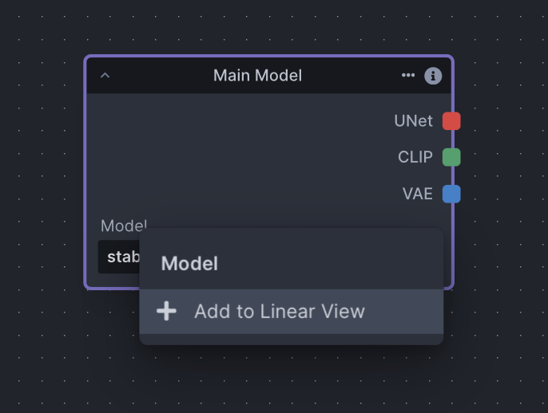
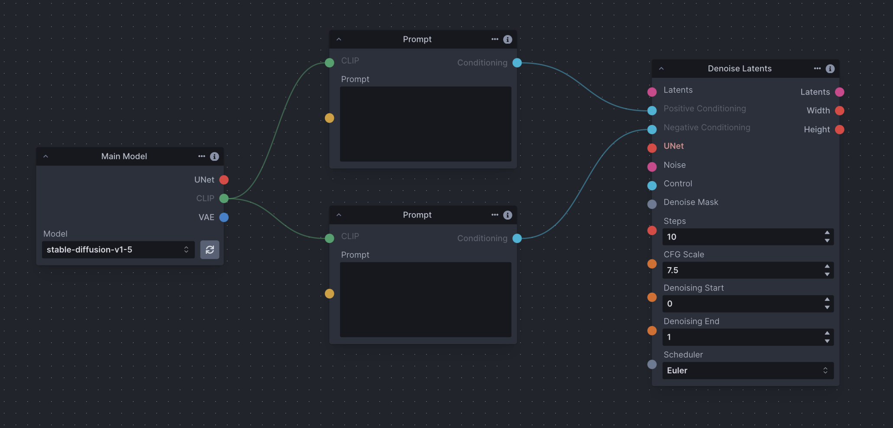

# Using the Workflow Editor

The workflow editor is a blank canvas allowing for the use of individual functions and image transformations to control the image generation workflow. Nodes take in inputs on the left side of the node, and return an output on the right side of the node. A node graph is composed of multiple nodes that are connected together to create a workflow. Nodes' inputs and outputs are connected by dragging connectors from node to node. Inputs and outputs are color coded for ease of use.

If you're not familiar with Diffusion, take a look at our [Diffusion Overview.](../help/diffusion.md) Understanding how diffusion works will enable you to more easily use the Workflow Editor and build workflows to suit your needs.

## UI Features

### Linear View
The Workflow Editor allows you to create a UI for your workflow, to make it easier to iterate on your generations. 

To add an input to the Linear UI, right click on the input and select "Add to Linear View".

The Linear UI View will also be part of the saved workflow, allowing you share workflows and enable other to use them, regardless of complexity. 

### Renaming Fields and Nodes
Any node or input field can be renamed in the workflow editor. If the input field you have renamed has been added to the Linear View, the changed name will be reflected in the Linear View and the node. 

### Managing Nodes

* Ctrl+C to copy a node
* Ctrl+V to paste a node
* Backspace/Delete to delete a node
* Shift+Click to drag and select multiple nodes 

## Important Concepts 

There are several node grouping concepts that can be examined with a narrow focus. These (and other) groupings can be pieced together to make up functional graph setups, and are important to understanding how groups of nodes work together as part of a whole. Note that the screenshots below aren't examples of complete functioning node graphs (see Examples).

### Noise

An initial noise tensor is necessary for the latent diffusion process. As a result, the Denoising node requires a noise node input.  

### Text Prompt Conditioning

Conditioning is necessary for the latent diffusion process, whether empty or not. As a result, the Denoising node requires positive and negative conditioning inputs. Conditioning is reliant on a CLIP text encoder provided by the Model Loader node.

### Image to Latents & VAE

The ImageToLatents node takes in a pixel image and a VAE and outputs a latents. The LatentsToImage node does the opposite, taking in a latents and a VAE and outpus a pixel image. 

### Defined & Random Seeds

It is common to want to use both the same seed (for continuity) and random seeds (for variety). To define a seed, simply enter it into the 'Seed' field on a noise node. Conversely, the RandomInt node generates a random integer between 'Low' and 'High', and can be used as input to the 'Seed' edge point on a noise node to randomize your seed.

### ControlNet

The ControlNet node outputs a Control, which can be provided as input to a Denoise Latents node. Depending on the type of ControlNet desired, ControlNet nodes usually require an image processor node, such as a Canny Processor or Depth Processor, which prepares an input image for use with ControlNet.

### LoRA

The Lora Loader node lets you load a LoRA and pass it as output.A LoRA provides fine-tunes to the UNet and text encoder weights that augment the base model’s image and text vocabularies.

### Scaling

Use the ImageScale, ScaleLatents, and Upscale nodes to upscale images and/or latent images. Upscaling is the process of enlarging an image and adding more detail. The chosen method differs across contexts. However, be aware that latents are already noisy and compressed at their original resolution; scaling an image could produce more detailed results.

### Iteration + Multiple Images as Input

Iteration is a common concept in any processing, and means to repeat a process with given input. In nodes, you're able to use the Iterate node to iterate through collections usually gathered by the Collect node. The Iterate node has many potential uses, from processing a collection of images one after another, to varying seeds across multiple image generations and more. This screenshot demonstrates how to collect several images and use them in an image generation workflow.

### Batch / Multiple Image Generation + Random Seeds

Batch or multiple image generation in the workflow editor is done using the RandomRange node. In this case, the 'Size' field represents the number of images to generate, meaning this example will generate 4 images. As RandomRange produces a collection of integers, we need to add the Iterate node to iterate through the collection. This noise can then be fed to the Denoise Latents node for it to iterate through the denoising process with the different seeds provided.

